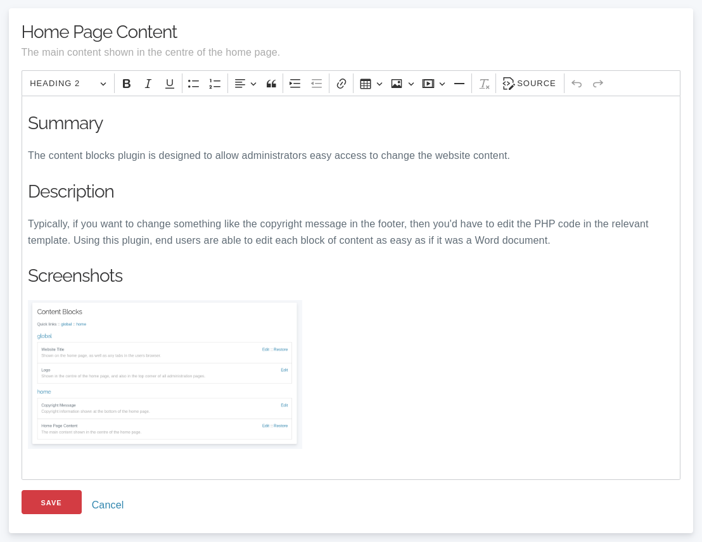
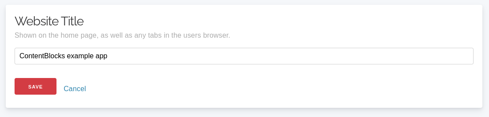
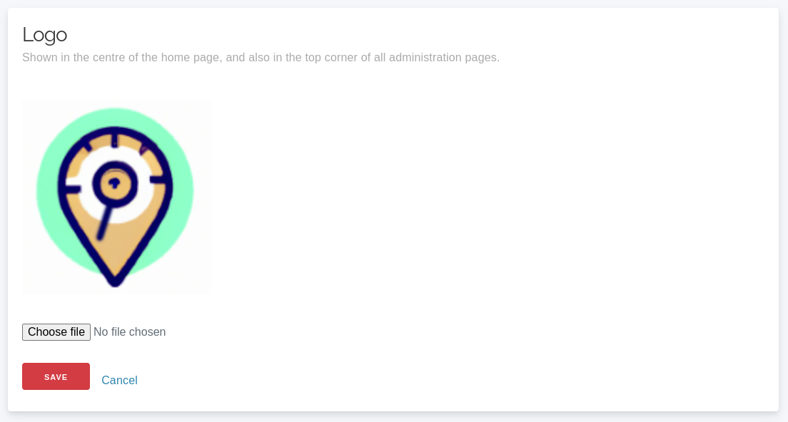

# CMS + Authentication Setup 
Please visit the IE Repository for any preparation steps required. 

To begin, import `schema.sql` into your SQL database. This can be done via PHPMyAdmin, you can find a guide on how to do it [here](https://help.one.com/hc/en-us/articles/115005588189-How-do-I-import-a-database-to-phpMyAdmin).

Read and edit the environment specific config/app_local.php and set up the
'Datasources'. 

### Define content blocks

Prior to showing content in your templates, you must first define what blocks are available.
This is done by inserting records into the `content_blocks` table, which is most easily done via [Seeds](https://book.cakephp.org/phinx/0/en/seeding.html).

Here is an **example** seed to create one content block of each type (`html`, `text`, and `image`):

```php
<?php
declare(strict_types=1);

use Migrations\AbstractSeed;

class ContentBlocksSeed extends AbstractSeed
{
    public function run(): void
    {
        $data = [
            [
                'parent' => 'global',
                'label' => 'Website Title',
                'description' => 'Shown on the home page, as well as any tabs in the users browser.',
                'slug' => 'website-title',
                'type' => 'text',
                'value' => 'ugie-cake/cakephp-content-blocks-example-app',
            ],
            [
                'parent' => 'global',
                'label' => 'Logo',
                'description' => 'Shown in the centre of the home page, and also in the top corner of all administration pages.',
                'slug' => 'logo',
                'type' => 'image',
            ],
            [
                'parent' => 'home',
                'label' => 'Home Page Content',
                'description' => 'The main content shown in the centre of the home page.',
                'slug' => 'home-content',
                'type' => 'html',
                'value' => '<p>Example app showcasing the <code>ugie-cake/cakephp-content-blocks</code> plugin.</p>',
            ],
            [
                'parent' => 'home',
                'label' => 'Copyright Message',
                'description' => 'Copyright information shown at the bottom of the home page.',
                'slug' => 'copyright-message',
                'type' => 'text',
                'value' => '(c) Copyright 2023, enter copyright owner here.',
            ],
        ];

        $table = $this->table('content_blocks');
        $table->insert($data)->save();
    }
}
```

### Insert defined content blocks into database

Once you have defined your content blocks in a seed (see above), then you can run the "Seed" to create the records in the database:

```
# Replace 'ContentBlocksSeed' with the name of your seed class from the previous step.
bin/cake migrations seed --seed ContentBlocksSeed

You can also choose to manually create additional records via SQL statements. An easy way to do it is through PHPMyAdmin.
```

### Use content blocks in views

Instead of hard coding content into views, output relevant content blocks.
This means that administrators never need to make code changes (or employ someone to make code changes)
if they require changes to most parts of the template.

This is done using the relevant `ContentBlocksHelper` functions:

```php
<?= $this->ContentBlock->html('home-content'); ?>
<?= $this->ContentBlock->image('logo'); ?>
<?= $this->ContentBlock->text('website-title'); ?>
```


## Reference

### HTML Block



#### Adding a HTML block

Add a new record to the `content_blocks` table with a `type` of `html`.

An [example seed can be found in the `HtmlBlockSeed.php` file](./config/Seeds/HtmlBlockSeed.php):
```php
<?php
# File: config/Seeds/HtmlBlockSeed.php
class HtmlBlockSeed extends \Migrations\AbstractSeed
{
    public function run(): void
    {
        $data = [
            [
                'parent' => 'about-us',
                'slug' => 'about-us-content',
                'label' => 'About Us - Main Content',
                'description' => 'Main block of code shown on the About Us page.',
                'type' => 'html',
                'value' => '
                    <h2>Our Story</h2>
                    <p>We are a small business, established in 2023 who sell candles to sick children.</p>
                ',
            ],
        ];

        $this->table('content_blocks')->insert($data)->save();
    }
}
```

#### Rendering a HTML block

In a layout or view template, add the following:

```php
<?= $this->ContentBlock->html('block-name') ?>
```

### Text Block



#### Adding an text block

Add a new record to the `content_blocks` table with a `type` of `text`.

An [example seed can be found in the `TextBlockSeed.php` file](./config/Seeds/TextBlockSeed.php):
```php
<?php
# File: config/Seeds/TextBlockSeed.php
class TextBlockSeed extends \Migrations\AbstractSeed
{
    public function run(): void
    {
        $data = [
            [
                'parent' => 'home',
                'slug' => 'website-title',
                'label' => 'Website Title',
                'description' => 'Heading shown on the main page, and also in the browser tab.',
                'type' => 'text',
                'value' => 'CakePHP Content Blocks Plugin',
            ],
        ];

        $this->table('content_blocks')->insert($data)->save();
    }
}
```

### Image Block



#### Adding an image block

Add a new record to the `content_blocks` table with a `type` of `image`.

An [example seed can be found in the `ImageBlockSeed.php` file](./config/Seeds/ImageBlockSeed.php):
```php
<?php
# File: config/Seeds/ImageBlockSeed.php
class ImageBlockSeed extends \Migrations\AbstractSeed
{
    public function run(): void
    {
        $data = [
            [
                'parent' => 'global',
                'slug' => 'logo',
                'label' => 'Logo',
                'description' => 'Shown on the home page, and also in the top left of each other page.',
                'type' => 'image',
            ],
        ];

        $this->table('content_blocks')->insert($data)->save();
    }
}
```


# CakePHP Application Skeleton


[](https://packagist.org/packages/cakephp/app)
[](https://github.com/phpstan/phpstan)

A skeleton for creating applications with [CakePHP](https://cakephp.org) 5.x, modified to include Authentication and CMS.

The framework source code can be found here: [cakephp/cakephp](https://github.com/cakephp/cakephp).


## Update

Since this skeleton is a starting point for your application and various files
would have been modified as per your needs, there isn't a way to provide
automated upgrades, so you have to do any updates manually.

## Configuration

Read and edit the environment specific `config/app_local.php` and set up the
`'Datasources'` and any other configuration relevant for your application.
Other environment agnostic settings can be changed in `config/app.php`.

## Layout

The app skeleton uses [Milligram](https://milligram.io/) (v1.3) minimalist CSS
framework by default. You can, however, replace it with any other library or
custom styles.
